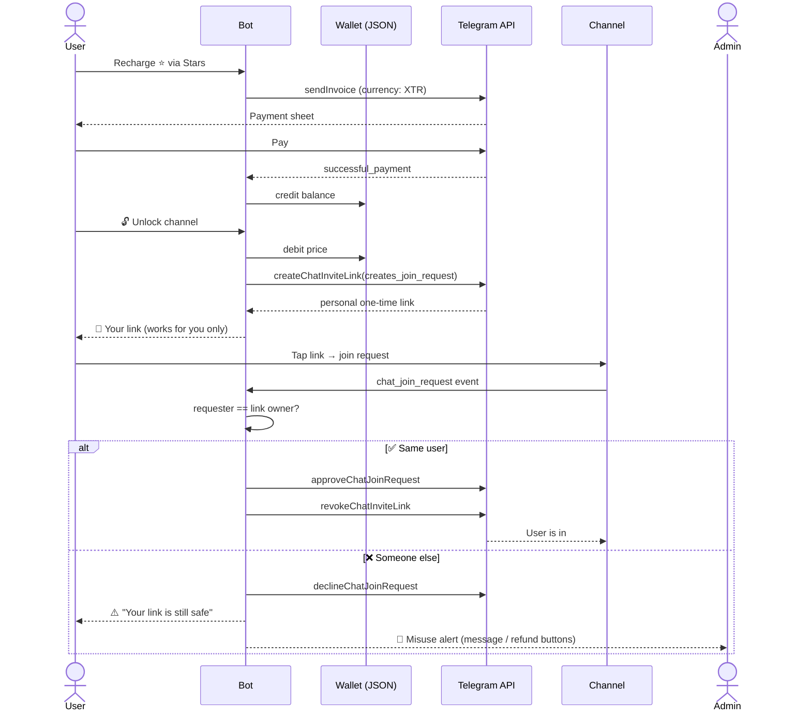

<div align="center">


<a href="https://git.io/typing-svg">
  
</a>

<br/>

<p>
  
  
  
  
  
</p>

<p>
  
  
  
</p>

**A production-ready Telegram bot that sells time-limited, single-use access to private channels — paid entirely in ⭐ Telegram Stars, with zero-trust link protection built in from the ground up.**

[Features](#-features) • [How It Works](#-how-it-works) • [Getting Started](#-getting-started) • [Configuration](#-configuration) • [Project Structure](#-project-structure) • [Security](#-security-model) • [License](#-license)

</div>

---

## 📖 Overview

**Telegram Paid Access Bot** turns any private Telegram channel into a paid product. Users top up an in-bot **wallet** using **Telegram Stars ⭐**, then spend that balance to instantly unlock a **personal, one-time join link**. That link belongs to exactly one person — anyone else who tries it gets silently declined, the rightful owner gets reassured, and admins get a real-time alert with a one-tap "message this user" and "refund" action.

No third-party payment gateway, no manual link sharing, no trust issues. Just `npm install`, drop in your bot token, and you have a fully automated paid-membership system.

<br/>

## ✨ Features

<table>
<tr>
<td width="50%" valign="top">

### 💰 Payments & Wallet
- Recharge balance with **Telegram Stars** (native, no external gateway)
- Preset recharge packages + custom amount
- Full transaction history per user
- 🎁 Peer-to-peer balance gifting
- 💳 Admin manual balance adjustment
- 🧪 **Per-admin test price** — try the whole flow for 1⭐ without touching your real pricing

</td>
<td width="50%" valign="top">

### 🔐 Access Control
- One-time, **user-locked** join links via `chat_join_request`
- Auto-approve the rightful buyer, auto-decline everyone else
- Link is **revoked instantly** after use — zero replay risk
- Safety-net `chat_member` monitor catches joins that bypass the flow entirely
- Optional **auto-kick** for unauthorized members

</td>
</tr>
<tr>
<td width="50%" valign="top">

### 🛠️ Admin Panel
- Add / edit / activate / deactivate channels
- Manual link generation (targeted or open)
- 🚫 Ban list management
- 📊 Payment history & lifetime revenue
- 📈 Live channel member counts
- 👑 Multi-admin roles with granular permissions
- 📣 Broadcast to every user who has ever recharged

</td>
<td width="50%" valign="top">

### 💬 Communication
- 🚨 Real-time misuse & intrusion alerts
- One-tap **"Message this user"** relay chat — works even without a username
- 🔄 One-tap **refund-to-wallet** for a compromised link
- Owner notified the instant their link is misused

</td>
</tr>
</table>

<br/>

## 🔄 How It Works

Every invite link this bot creates uses Telegram's `creates_join_request: true` flag — nobody ever joins instantly. They send a **join request**, and the bot decides in real time whether to let them in.



> 💡 As a second layer of defense, `chat_member` updates are also monitored — so even someone who joins through an old primary invite link, or who's added directly, gets caught, reported with the exact link used, and (optionally) auto-kicked.

<br/>

## 🚀 Getting Started

### Prerequisites

| Requirement | Notes |
|---|---|
| **Node.js 18+** | Runtime |
| **Bot token** | From [@BotFather](https://t.me/BotFather) |
| **Private channel(s)** | Bot must be an **admin** with *"Invite Users via Link"* and *"Ban Users"* permissions |

### Installation

```bash
git clone https://github.com/Michaelsir916/automanagebot/blob/main/README.md
cd telegram-paid-access-bot
npm install
cp .env.example .env
```

Edit `.env`:

```env
BOT_TOKEN=your_bot_token_here
ADMIN_IDS=123456789
AUTO_KICK_UNPAID=true
```

> ⚠️ **Important:** Every admin (bootstrap or added later) must send `/start` to the bot at least once. Telegram won't let a bot message a user who hasn't started a conversation with it — this is required for alerts and the relay chat to work.

Run it:

```bash
npm start
```

<details>
<summary><b>🔧 Deploying with PM2 (recommended for a VPS)</b></summary>
<br/>

```bash
pm2 start ecosystem.config.js
pm2 save
pm2 logs paid-access-bot
```

The included `ecosystem.config.js` auto-restarts on crash and caps memory at 300 MB.

</details>

<br/>

## ⚙️ Configuration

| Variable | Description | Default |
|---|---|---|
| `BOT_TOKEN` | Your bot token from @BotFather | — *(required)* |
| `ADMIN_IDS` | Comma-separated Telegram user IDs — **bootstrap super admins** with permanent full access, independent of `data/admins.json` | — *(required)* |
| `AUTO_KICK_UNPAID` | Auto-kick anyone who becomes a member without going through the paid flow | `true` |

<br/>

## 📢 Adding a Channel

1. Add the bot as an **admin** in your private channel with the permissions listed above
2. In the bot: **Admin Panel → Manage Channels → ➕ Add Channel**
3. Send the channel's numeric chat ID — forward any message from the channel to `@userinfobot`, or check the bot's console logs the first time it sees an update from that chat (IDs look like `-100xxxxxxxxxx`)
4. Set a title, price (⭐), and test price (⭐ for admins)

<br/>

## 🗂️ Project Structure

```text
telegram-paid-access-bot/
├── ecosystem.config.js       # PM2 process config
├── package.json
├── .env.example
└── src/
    ├── bot.js                # Entry point — wires everything together
    ├── config.js              # Environment variables
    ├── state.js                # In-memory wizard & relay-chat state
    ├── db/                      # Atomic JSON data access layer
    │   ├── atomicWrite.js
    │   ├── channels.js
    │   ├── wallets.js
    │   ├── links.js
    │   ├── payments.js
    │   ├── admins.js
    │   └── bans.js
    ├── utils/
    │   ├── ids.js
    │   ├── format.js
    │   ├── notify.js
    │   └── keyboards.js
    └── handlers/
        ├── start.js            # /start, main menu
        ├── channels.js          # Browse + unlock channels
        ├── wallet.js             # Recharge, gift, history
        ├── joinRequest.js         # 🔐 Core approve/decline logic
        ├── memberGuard.js          # Unauthorized-join safety net
        ├── relayChat.js             # Admin ↔ user messaging
        └── admin/                    # Admin panel screens
            ├── panel.js
            ├── channelManage.js
            ├── manualLink.js
            ├── broadcast.js
            ├── walletAdmin.js
            ├── banList.js
            ├── paymentHistory.js
            ├── adminRoles.js
            └── refundAction.js
```

<br/>

## 🔒 Security Model

- **Deduct-after-success** — wallet balance is only debited *after* the invite link is successfully created, so a Telegram API failure never charges a user for nothing
- **Single source of truth per link** — every issued link is tracked with its owner, status, and price in `data/links.json`
- **Immediate revocation** — the moment a link is used, it's revoked on Telegram's side; a screenshot of an already-used link is worthless
- **Two independent guards** — `chat_join_request` handles the normal flow, `chat_member` catches anything that slips through another route
- **Bootstrap admins can't be locked out** — `ADMIN_IDS` in `.env` always has full access, regardless of what's in `data/admins.json`

<br/>

## 💾 Data Storage

Plain JSON files under `data/` (git-ignored, created automatically on first run), written **atomically** — to a temp file, then renamed — so a crash mid-write never corrupts your data.

| File | Contents |
|---|---|
| `channels.json` | Configured channels, prices, active status |
| `wallets.json` | Balances and full transaction history per user |
| `links.json` | Every invite link ever issued and its status |
| `payments.json` | Stars recharge history |
| `admins.json` | Moderators added beyond the bootstrap `ADMIN_IDS` |
| `bans.json` | Banned users |

> This is intentionally a single-process design. If you ever need to scale beyond one bot instance, swap these modules for a real database without touching any handler logic — all data access already goes through `src/db/*.js`.

<br/>

## 🤝 Contributing

Contributions, issues, and feature requests are welcome!

```bash
git checkout -b feature/your-idea
# make your changes
git commit -m "Add: your idea"
git push origin feature/your-idea
```

Then open a pull request. For major changes, please open an issue first to discuss what you'd like to change.

<br/>

## 📄 License

Distributed under the **MIT License**. See `LICENSE` for more information.

<br/>

<div align="center">


**⭐ If this project is useful to you, consider giving it a star!**

</div>
